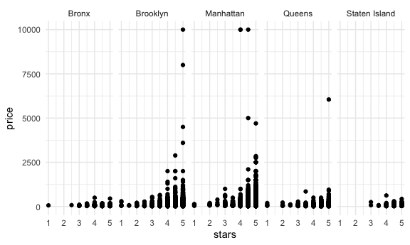

case\_study
================

Load in a dataset that we’ll use often

``` r
library(tidyverse)
```

    ## ── Attaching packages ─────────────────────────────────────── tidyverse 1.3.1 ──

    ## ✓ ggplot2 3.3.5     ✓ purrr   0.3.4
    ## ✓ tibble  3.1.4     ✓ dplyr   1.0.7
    ## ✓ tidyr   1.1.3     ✓ stringr 1.4.0
    ## ✓ readr   2.0.1     ✓ forcats 0.5.1

    ## ── Conflicts ────────────────────────────────────────── tidyverse_conflicts() ──
    ## x dplyr::filter() masks stats::filter()
    ## x dplyr::lag()    masks stats::lag()

``` r
library(p8105.datasets)

knitr::opts_chunk$set(
  fig.width = 6,
  fig.asp = .6,
  out.width = "90%"
)

theme_set(theme_minimal() + theme(legend.position = "bottom"))

options(
  ggplot2.continuous.colour = "viridis",
  ggplot2.continuous.fill = "viridis"
)

scale_colour_discrete = scale_colour_viridis_d
scale_fill_discrete = scale_fill_viridis_d
```

## Load a dataset

``` r
data("nyc_airbnb")

view(nyc_airbnb)
```

Questions that we might be interested in asking using this: \* Is price
correlated with review score? \* Which neighborhood is most popular? \*
Which neighborhood is the most expensive? \* Which neighborhood has the
highest reviews? \* Is availability related to price? \* Is room type
related to neighborhood? \* Is length of stay related to neighborhood
group (borough)?

Start with: How many rentals are there? Of what type? In what places?

``` r
nyc_airbnb = nyc_airbnb %>% 
  mutate(stars = review_scores_location/2) %>% 
  rename(borough = neighbourhood_group)
```

Let’s try to count things:

``` r
nyc_airbnb %>% 
  count(borough)
```

    ## # A tibble: 5 × 2
    ##   borough           n
    ##   <chr>         <int>
    ## 1 Bronx           649
    ## 2 Brooklyn      16810
    ## 3 Manhattan     19212
    ## 4 Queens         3821
    ## 5 Staten Island   261

Number of units per borough

``` r
nyc_airbnb %>% 
  janitor::tabyl(borough, room_type)
```

    ##        borough Entire home/apt Private room Shared room
    ##          Bronx             192          429          28
    ##       Brooklyn            7427         9000         383
    ##      Manhattan           10814         7812         586
    ##         Queens            1388         2241         192
    ##  Staten Island             116          144           1

``` r
nyc_airbnb %>% 
  count(borough, room_type) %>% 
  pivot_wider(
    names_from = room_type, 
    values_from = n)
```

    ## # A tibble: 5 × 4
    ##   borough       `Entire home/apt` `Private room` `Shared room`
    ##   <chr>                     <int>          <int>         <int>
    ## 1 Bronx                       192            429            28
    ## 2 Brooklyn                   7427           9000           383
    ## 3 Manhattan                 10814           7812           586
    ## 4 Queens                     1388           2241           192
    ## 5 Staten Island               116            144             1

Case Study: Is price correlated with review score?

``` r
nyc_airbnb %>% 
  drop_na(stars) %>% 
  ggplot(aes(x = stars, y = price, color = borough)) + 
  geom_point()
```


